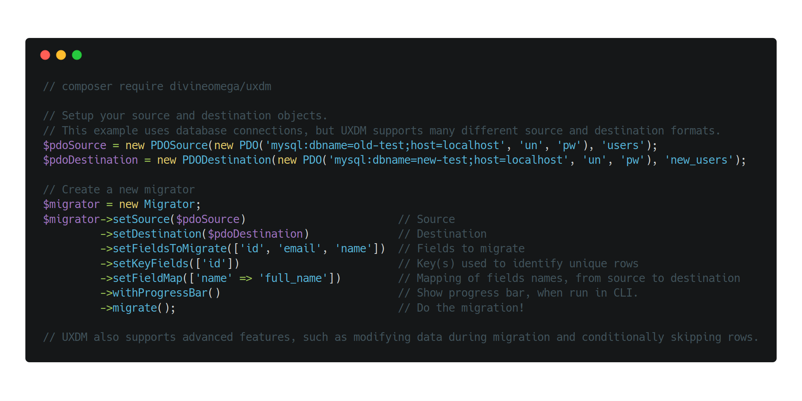

# 🔀 Universal Extensible Data Migrator (UXDM)

UXDM helps developers migrate data from one system or format to another.

<p align="center">
    
</p>

<p align="center">
    <a href="https://travis-ci.org/DivineOmega/uxdm"></a>
    <a href="https://coveralls.io/github/DivineOmega/uxdm?branch=master"></a>
    <a href="https://styleci.io/repos/130364449"></a>
    
</p>

## Installation

UXDM can be easily installed using Composer. Just run the following command from the root of your project.

```
composer require divineomega/uxdm
```

If you have never used the Composer dependency manager before, head to the [Composer website](https://getcomposer.org/) for more information on how to get started.

## Migrations

Each UXDM migration requires a source object and at least one destination object. These determine where and how data is read and written. The UXDM package comes with a variety of source and destination objects, including the following.

* PDO (PHP Database Object) Source & Destination
* CSV (Comma Seperated Values) Source & Destination
* Associative Array Source & Destination
* JSON Files Source & Destination
* XML Source & Destination
* WordPress Post Source
* WordPress User Source
* Debug Output Destination

Source and destination objects can be used in any combination. Data can be migrated from a CSV and inserted into a database, just as easily as data can be migrated from a database to a CSV.

You can also use similar source and destination objects in the same migration. For example, a common use of UXDM is to use a PDO source and PDO destination to transfer data from one database to another. 

Please see the [Sources & Destinations](/docs/uxdm-sources-and-destinations.md) page for more detailed documentation on their usage.

## Examples

### Database to database migration

An example of a basic database to database UXDM migration is shown below.

```php
$pdoSource = new PDOSource(new PDO('mysql:dbname=old-test;host=127.0.0.1', 'root', 'password123'), 'users');

$pdoDestination = new PDODestination(new PDO('mysql:dbname=new-test;host=127.0.0.1', 'root', 'password456'), 'new_users');

$migrator = new Migrator;
$migrator->setSource($pdoSource)
         ->setDestination($pdoDestination)
         ->setFieldsToMigrate(['id', 'email', 'name'])
         ->setKeyFields(['id'])
         ->migrate();
```

This migration will move the `id`, `email` and `name` fields from the the `users` table in the `old-test` database, to the `new_users` table in the `new-test` database, replacing any existing records with the same `id` (the key field).

### Mapping field names from source to destination

This examples shows how UXDM can map field names from source to destination.

```php
$migrator = new Migrator;
$migrator->setSource($pdoSource)
         ->setDestination($pdoDestination)
         ->setFieldsToMigrate(['id', 'email', 'name'])
         ->setKeyFields(['id'])
         ->setFieldMap(['name' => 'full_name'])
         ->migrate();
```

This migration will move data from the source `name` field into the destination `full_name` field, while still moving the `id` and `email` fields normally.

### Modifying data items during migration

The following example shows how you can use UXDM to modify items of data during the migration process.

```php
$migrator = new Migrator;
$migrator->setSource($pdoSource)
         ->setDestination($pdoDestination)
         ->setFieldsToMigrate(['id', 'email', 'name'])
         ->setKeyFields(['id'])
         ->setDataItemManipulator(function($dataItem) {
            if ($dataItem->fieldName=='name') {
                $dataItem->value = strtoupper($dataItem->value);
            }
         })
         ->migrate();
```

This migration will move user data between two databases. However, it will also convert the value in the `name` field to uppercase.

### Modifying data rows during migration

#### Adding data items

This examples shows how UXDM can modify each row of data while the migration is taking place.

```php
$migrator = new Migrator;
$migrator->setSource($pdoSource)
         ->setDestination($pdoDestination)
         ->setFieldsToMigrate(['id', 'email', 'name'])
         ->setKeyFields(['id'])
         ->setDataRowManipulator(function($dataRow) {
            $dataRow->addDataItem(new DataItem('random_number', rand(1,1000)));
         })
         ->migrate();
```

This migration will add a random number into a field called `random_number` for each row of data. This will then be migrated to the destination database along with the other fields.

#### Removing data items

This example demonstrates how data items can be removed from a data row. You may wish to do this if you want to use its value, but not actually migrate it to the destination.

```php
$migrator = new Migrator;
$migrator->setSource($pdoSource)
         ->setDestination($pdoDestination)
         ->setFieldsToMigrate(['id', 'email', 'name'])
         ->setKeyFields(['id'])
         ->setDataRowManipulator(function($dataRow) {
            $emailDataItem = $dataRow->getDataItemByFieldName('email');
            $dataRow->addDataItem(new DataItem('email_hash', md5($emailDataItem->value)));
            $dataRow->removeDataItem($emailDataItem);
         })
         ->migrate();
```

This migration gets the data from the `email` field in the source, creates a new `email_hash` data item which contains an md5 of the email address, and then removes the original `email` data item. This new `email_hash` will then be migrated to the destination database along with the other fields, excluding the removed `email` field.
